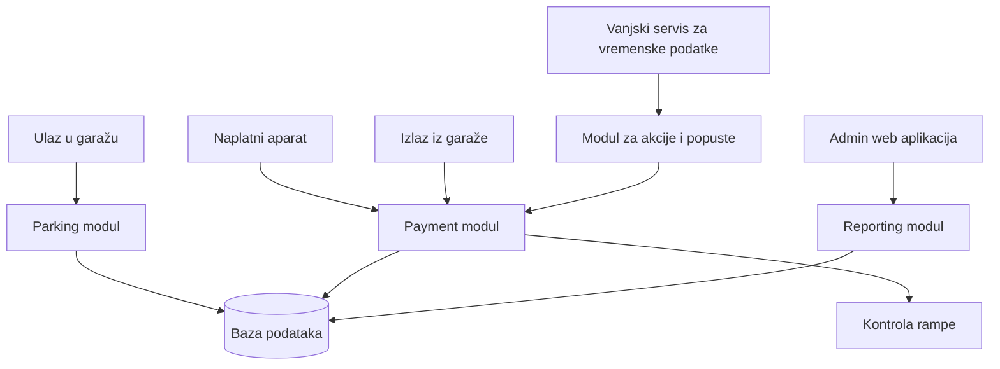

# Zadatak 2 - Analiza zahtjeva i idejno rješenje sustava garaže

## 1. Kratki opis sustava

Sustav služi za vođenje garažnog parkirališta. Glavni dio sustava je evidencija ulaska, zauzimanja mjesta, naplate i izlaska vozila iz garaže.

Najvažniji proces je naplata parkiranja. Taj dio sustava ne smije ovisiti o manje važnim funkcionalnostima kao što su prikaz slobodnih mjesta po katu ili obračun promotivnih akcija. Ako se dogodi greška u prikazu statistike ili slobodnih mjesta, korisnik i dalje mora moći platiti parkiranje i izaći iz garaže.

## 2. Ključni dijelovi sustava

Sustav bih podijelila na nekoliko glavnih dijelova:

* evidencija ulaska vozila
* evidencija izlaska vozila
* upravljanje parkirnim mjestima
* naplata parkiranja
* ugovorni korisnici
* prikaz slobodnih mjesta
* obračun akcija i popusta
* mjesečni izvještaji
* administracija korisnika i prava pristupa

Posebno bih odvojila naplatu od izvještaja i promotivnih akcija, jer naplata mora raditi pouzdano i u slučaju da ostali dijelovi sustava trenutno nisu dostupni.

## 3. Ključni procesi

### Ulazak vozila

Kod ulaska se evidentira vrijeme ulaska i vozilu se dodjeljuje identifikator. To može biti kartica, registarska oznaka ili neki drugi identifikator, ali taj dio nije dovoljno razjašnjen u zahtjevu. Sustav zatim zauzima jedno slobodno parkirno mjesto.

### Plaćanje

Kod plaćanja se dohvaća aktivna parking sesija, računa se trajanje parkiranja i iznos za naplatu. Ako je vozilo bilo parkirano na nenatkrivenom mjestu i barem 33% vremena je bilo kišno, primjenjuje se kišni popust.

Nakon uspješnog plaćanja zapisuje se vrijeme plaćanja. Korisnik tada ima 10 minuta za izlaz iz garaže.

### Izlazak vozila

Kod izlaska se provjerava postoji li plaćanje i je li od plaćanja prošlo manje od 10 minuta. Ako jest, rampa se otvara. Ako je prošlo više od 10 minuta, potrebno je obračunati dodatno vrijeme.

### Izvještavanje

Mjesečni izvještaji trebaju prikazati prihod, broj parkiranja, popunjenost garaže i učinak kišne akcije. Izvještaji nisu kritični za trenutni rad garaže, ali su važni za poslovnu analizu.

## 4. Potencijalni problemi i otvorena pitanja

Neki zahtjevi nisu potpuno definirani i trebalo bi ih dodatno razjasniti s klijentom:

* koristi li se kartica, registarska oznaka ili neki drugi identifikator vozila
* što se događa ako korisnik izgubi karticu
* kako se točno dohvaća podatak o kiši
* što se događa ako sustav za vremensku prognozu nije dostupan
* kako se postupa kod nestanka interneta ili struje
* postoje li različite tarife za različite korisnike
* kako se obrađuju ugovorni korisnici
* smije li isti korisnik imati više aktivnih parkiranja

## 5. Idejni nacrt baze podataka

### Users

* Id
* Email
* PasswordHash
* Role
* UserType

### Vehicles

* Id
* RegistrationNumber
* UserId

### ParkingSpots

* Id
* Floor
* IsCovered
* IsOccupied

### ParkingSessions

* Id
* VehicleId
* ParkingSpotId
* EntryTime
* ExitTime
* PaymentTime
* IsPaid
* TotalAmount

### Payments

* Id
* ParkingSessionId
* Amount
* PaymentMethod
* PaidAt

### Contracts

* Id
* UserId
* ValidFrom
* ValidTo
* MonthlyPrice
* IsActive

### WeatherRecords

* Id
* RecordedAt
* IsRainy

### Reports

* Id
* Month
* Year
* TotalIncome
* AverageOccupancy
* RainDiscountAmount

## 6. Big picture arhitektura



Parking modul vodi ulaske, izlaske i zauzetost mjesta. Payment modul je odvojen jer je naplata najvažniji dio sustava. Reporting modul koristi podatke iz baze, ali ne utječe direktno na proces naplate. Modul za akcije i popuste može se kasnije proširiti ako klijent uvede nove akcije osim kišnog popusta.

## 7. Pseudokod procesa naplate

```text
function payParking(identifier):
    session = findActiveParkingSession(identifier)

    if session does not exist:
        return error

    duration = currentTime - session.entryTime
    amount = calculateBasePrice(duration)

    if session.parkingSpot is not covered:
        rainyDuration = calculateRainyDuration(session.entryTime, currentTime)

        if rainyDuration >= duration * 0.33:
            amount = amount * 0.5

    savePayment(session.id, amount, currentTime)
    markSessionAsPaid(session.id, currentTime)

    return amount
```

## 8. Pseudokod izlaska iz garaže

```text
function exitGarage(identifier):
    session = findActiveParkingSession(identifier)

    if session is not paid:
        denyExit

    minutesAfterPayment = currentTime - session.paymentTime

    if minutesAfterPayment <= 10:
        openGate
        closeParkingSession
        freeParkingSpot
    else:
        calculateAdditionalPayment
        denyExitUntilPaid
```

## 9. Zaključak

Kod ovog sustava prvo bih osigurala stabilan proces ulaska, naplate i izlaska iz garaže. Nakon toga bih dodala prikaz slobodnih mjesta po katovima, mjesečne izvještaje i akcije poput kišnog popusta. Na taj način se najvažniji dio sustava razvija prvi, a dodatne funkcionalnosti se mogu nadograđivati bez ugrožavanja naplate.
